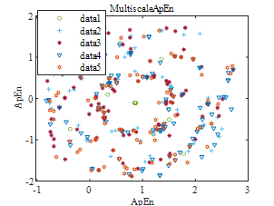
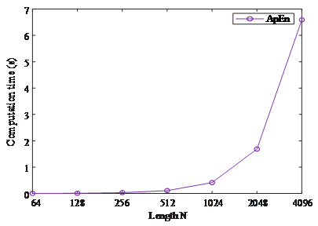

近似熵(Approximate Entropy)
==============================

基本原理
~~~~~~~~~~~~~~~

给定长度为 :math:`\left\{ {x\left( i \right),i = 1,2, \cdots ,N} \right\}` 的时间序列  :math:`\left\{ {x\left( i \right),i = 1,2, \cdots ,N} \right\}`，近似熵的计算步骤如下：

1.	对 :math:`X` 重构相空间，嵌入维度为 :math:`m` ，形成 :math:`m` 维的向量序列:，可以表示为:

.. math::
    \left\{ {X\left( 1 \right),X\left( 2 \right), \cdots ,X\left( {N - m + 1} \right)} \right\},X\left( i \right) = \left\{ {x\left( i \right),x\left( {i + 1} \right), \cdots ,x\left( {i + m - 1} \right)} \right\},1 \le i \le N - m + 1 \tag{1}

2.	定义 :math:`d\left[ {X\left( i \right),X\left( j \right)} \right]`  是向量  :math:`X\left( i \right)` 和 :math:`X\left( j \right)` 的切比雪夫距离，即两个向量对应元素之间差值绝对值的最大值:

.. math::
    d\left[ {X\left( i \right),X\left( j \right)} \right] = \mathop {\max }\limits_{k = 0,1, \cdots ,m - 1} \left[ {\left| {x\left( {i + k} \right) - x\left( {j + k} \right)} \right|} \right] \tag{2}

对于 :math:`X\left( i \right),1 \le i \le N - m + 1`，需要计算其与剩余其他向量 :math:`X\left( j \right),1 \le j \le N,j \ne i` 之间的 :math:`d\left[ {X\left( i \right),X\left( j \right)} \right]`。因此对任意 :math:`X\left( i \right)` 都有  :math:`N - m` 个距离 。

3.	给定阈值 :math:`r` ，对于所有的 :math:`X\left( i \right)` ，统计 :math:`d\left[ {X\left( i \right),X\left( j \right)} \right]` 中小于阈值 :math:`r` 的数量，然后这个数量与总距离数 :math:`N - m`  的比值记为:

.. math::
    C_i^m\left( r \right) = \frac{{{\rm{number}}\left\{ {i|1 \le i \le N - m + 1,d\left[ {X\left( i \right),X\left( j \right)} \right] < r} \right\}}}{{N - m}} \tag{3}
	
4.	对  :math:`C_i^m\left( r \right)`  取对数，然后计算所有  :math:`N - m + 1`  个 的均值，记为:

.. math::
   {\phi ^m}\left( r \right) = \frac{1}{{N - m + 1}}\sum\limits_{i = 1}^{N - m + 1} {\ln C_i^m\left( r \right)} \tag{4}

5.	将嵌入维度增加到 :math:`m + 1`，重复以上步骤1-步骤4，得到  :math:`C_i^{m + 1}\left( r \right)` 和 :math:`{\phi ^{m + 1}}\left( r \right)`。
6.	理论上，近似熵可以被计算为：

.. math::
  ApEn\left( {m,r} \right) = \mathop {\lim }\limits_{N \to \infty } \left[ {{\phi ^m}\left( r \right) - {\phi ^{m + 1}}\left( r \right)} \right] \tag{5}

由于实际信号的 不能趋近于无穷大，有限序列的近似熵定义为:

.. math::
  ApEn\left( {m,r,N} \right) = {\phi ^m}\left( r \right) - {\phi ^{m + 1}}\left( r \right) \tag{6}

.. note:: This is a note admonition.
 近似熵是由Pincus\ :sup:`[1]`\提出的，建议的参数选择为：

 - 嵌入维度  :math:`m=2` 
 - 容限  :math:`r`   一般取 `0.1~0.2` 倍时间序列的标准差（SD）。在后续的仿真验证中，我们选择   :math:`r = 0.15 \times {\rm{SD}}` 。

 
代码实现
~~~~~~~~~~~~~~~
这里假设您已经获得本项目的的所有代码，若您此时还未获得有关程序，请移步到 :doc:`/content/11`

近似熵(Approximate Entropy)的核心程序为 **ApproximateEntropy**

.. highlight:: sh

::

  function AE=ApproximateEntropy(data,m,r)  % 输入的时间序列data为列向量即可
      AE=ApproximateEntropy1(data,m,r);
  end
  

仿真验证
~~~~~~~~~~~~~~~

近似熵的脉冲检测结果
------------------------------------

 
多尺度近似熵的故障分类可视化结果
------------------------------------
 

 
 

 
